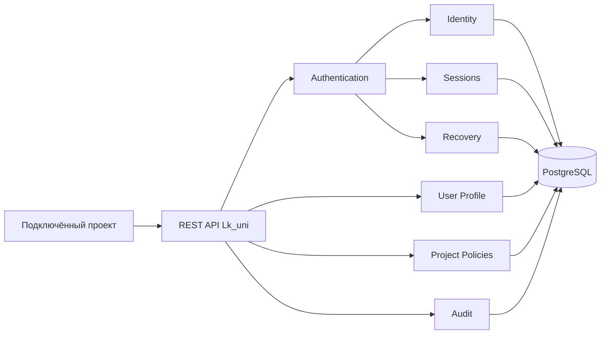

<div align="center">

# Lk_uni

### Создавайте свой продукт. Управление пользователями возьмёт на себя Lk_uni.

**Open Source платформа идентификации, авторизации, управления пользователями и личными кабинетами для подключаемых проектов.**

[Статус](PROJECT_STATUS.md) · [Быстрый старт](#быстрый-старт) · [Архитектура](#архитектура) · [Документация](#документация) · [Дорожная карта](ROADMAP.md)

</div>

---

## Что такое Lk_uni

Lk_uni — самостоятельная Identity Platform для SaaS, CRM, интернет-магазинов, Telegram Mini Apps, корпоративных порталов и внутренних информационных систем.

Платформа должна предоставлять подключаемым проектам единые контуры регистрации, входа, восстановления доступа, управления профилем, identities, сессиями и разрешениями без повторной разработки критичной auth-инфраструктуры.

> **Lk_uni не является библиотекой, CMS или UI-фреймворком.** Это отдельный сервис идентификации, авторизации и управления пользователями.

## Текущий статус

Проект находится в активной разработке и ещё не является production-релизом.

Текущая рабочая основа:

- Node.js и Express;
- PostgreSQL 16 и Knex;
- React и Vite;
- первая вертикаль Auth Core;
- отдельный преимущественно читающий контур ChatGPT User App.

В коде уже присутствуют project-aware регистрация, подтверждение identity, вход, access/refresh tokens, rotation, logout, просмотр и отзыв собственных сессий, rate limits и базовый audit log.

Полный процесс восстановления забытого пароля, OpenAPI, production provider adapters, модульный Platform Kernel и окончательные границы Identity ещё не считаются завершёнными.

Фактическое состояние каждого направления приведено в [PROJECT_STATUS.md](PROJECT_STATUS.md).

## Статусы возможностей

| Возможность | Статус |
|---|---:|
| PostgreSQL foundation, миграции и seed | Реализовано, требуется подтверждение чистого запуска |
| Регистрация и подтверждение identity | Первая рабочая вертикаль |
| Вход и `/me` | Первая рабочая вертикаль |
| Access/refresh tokens и rotation | Первая рабочая вертикаль |
| Logout и управление собственными сессиями | Первая рабочая вертикаль |
| Базовый audit log и rate limits | Первая рабочая вертикаль |
| Восстановление забытого пароля | Запланировано, реализация не подтверждена |
| Identity Core как отдельный модуль | Запланировано эволюционное выделение |
| Platform Kernel | Запланировано |
| Authorization, Organizations, Admin Console | Запланировано |
| OpenAPI и SDK | Запланировано |
| Русский и английский пользовательский интерфейс | Обязательное требование, ещё не завершено |

## Главный принцип идентичности

Пользователь — единая сущность. Email, телефон, Telegram, MAX, VK ID, SberID и другие каналы являются связанными способами идентификации, а не отдельными аккаунтами.

```text
User
  └── Identities
        ├── email
        ├── phone
        ├── telegram
        ├── max
        ├── vk
        └── sberid
```

## Архитектура



Целевое направление развития:

```text
Подтверждённый существующий backend
        ↓
Platform Kernel
        ↓
Identity
        ↓
Authentication
        ↓
Authorization
        ↓
Organizations / Projects
        ↓
Administration / Integrations
```

Kernel и Identity выделяются из существующего backend небольшими проверяемыми изменениями. Параллельная реализация второго Auth Core не создаётся.

## Контуры доступа

1. **Пользовательское приложение** — работа только с собственным профилем, identities и сессиями.
2. **Приложение администратора проекта** — управление только одним явно разрешённым проектом.
3. **Консоль владельца платформы** — глобальные настройки Lk_uni, изолированные от пользовательских интеграций.

## Быстрый старт

```bash
git clone https://github.com/julcapp/Lk_uni.git
cd Lk_uni
```

Backend:

```bash
cd backend
npm ci
```

Дальнейшие команды, конфигурация PostgreSQL и критерии проверки приведены в [backend/README.md](backend/README.md).

> Чистый запуск всей системы ещё проходит формальную проверку. Не считайте проект воспроизводимым, пока задачи baseline не закрыты результатами выполнения команд.

## Структура репозитория

```text
backend/       текущий API, Auth Core и PostgreSQL
frontend/      пользовательский React/Vite-прототип
demo/          демонстрационные сценарии
chatgpt-app/   отдельный пользовательский контур ChatGPT App
docs/          архитектура, API, ADR и планы
.github/       шаблоны и автоматизация GitHub
```

## Документация

### Продукт

- [Видение продукта](PRODUCT_VISION.md)
- [Манифест](MANIFEST.md)
- [Статус проекта](PROJECT_STATUS.md)
- [Дорожная карта](ROADMAP.md)
- [История изменений](CHANGELOG.md)

### Архитектура и интеграция

- [Архитектура v1.0](docs/ARCHITECTURE_v1.0.md)
- [PostgreSQL-модель данных](docs/POSTGRES_DB_MODEL.md)
- [API Contract v1.0](docs/API_CONTRACT_v1.0.md)
- [Account Recovery](docs/ACCOUNT_RECOVERY.md)
- [Integration Guide](docs/INTEGRATION_GUIDE.md)
- [Журнал решений](DECISIONS.md)

Документы могут описывать целевое состояние. Фактически реализованное состояние всегда определяется кодом, тестами и [PROJECT_STATUS.md](PROJECT_STATUS.md).

### Open Source

- [Участие в разработке](CONTRIBUTING.md)
- [Кодекс поведения](CODE_OF_CONDUCT.md)
- [Политика безопасности](SECURITY.md)
- [Поддержка](SUPPORT.md)

## Definition of Done

Функция или модуль считаются завершёнными только при наличии:

- рабочей реализации;
- позитивных и негативных тестов;
- подтверждённого запуска в поддерживаемом окружении;
- актуальной документации;
- записи в CHANGELOG;
- успешного CI;
- понятного Pull Request.

## Принцип принятия решений

> **Делает ли изменение интеграцию проще для разработчика, не ослабляя безопасность и изоляцию проектов?**

## Безопасность

Не публикуйте сведения об уязвимостях, токены, пароли или персональные данные в открытых Issues. Используйте порядок из [SECURITY.md](SECURITY.md).

## Лицензия

Окончательная open source лицензия будет закреплена до первого публичного alpha-релиза. До появления файла `LICENSE` автоматическое разрешение на использование, изменение и распространение исходного кода не предоставлено.
