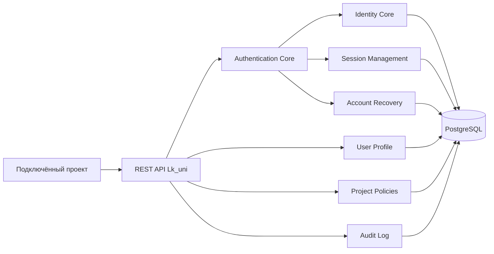

<div align="center">

# Lk_uni

### Создавайте свой продукт. Управление пользователями возьмёт на себя Lk_uni.

**Open Source платформа регистрации, авторизации, управления пользователями и личными кабинетами для любых проектов.**

[Быстрый старт](#быстрый-старт) · [Возможности](#возможности) · [Архитектура](#архитектура) · [Документация](#документация) · [Дорожная карта](ROADMAP.md)

</div>

---

## Что такое Lk_uni

Lk_uni — самостоятельная Identity Platform, которую можно подключить к SaaS-сервису, CRM, интернет-магазину, Telegram Mini App, корпоративному порталу или внутренней системе одной интеграцией.

Проект получает готовые контуры регистрации, входа, восстановления доступа, управления профилем, сессиями и пользовательскими identities без повторной разработки критичной auth-инфраструктуры.

> **Lk_uni не является библиотекой, CMS или UI-фреймворком.** Это отдельная платформа идентификации, авторизации и управления пользователями.

## Статус проекта

Lk_uni находится в активной разработке. Целевой стек: **Node.js · Express · PostgreSQL · React**.

Уже реализована первая вертикаль PostgreSQL Auth Core:

- project-aware регистрация и вход;
- подтверждение identity;
- JWT access/refresh и ротация refresh-токенов;
- просмотр и отзыв собственных сессий;
- аудит событий;
- интеграционные тесты на PostgreSQL 16.

Текущий этап не является production-релизом. Публичные API и схема данных могут изменяться до первой alpha-версии.

## Возможности

| Контур | Возможности |
|---|---|
| Идентификация | Email, телефон и внешние провайдеры как связанные identities одного пользователя |
| Авторизация | Регистрация, вход, access/refresh tokens, выход и отзыв сессий |
| Восстановление | Полный процесс восстановления забытого пароля через подтверждённые identities |
| Пользователь | Профиль, настройки, согласия и будущий личный кабинет |
| Проекты | Изоляция данных и политик каждого подключённого проекта |
| Безопасность | Аудит, ограничение попыток, отзыв токенов и безопасные настройки по умолчанию |
| Интеграция | REST API, будущие SDK и готовые виджеты |
| Интерфейс | Русский и английский языки с единым переключением на всех пользовательских экранах |

## Для каких продуктов

- SaaS, CRM и ERP;
- интернет-магазины и маркетплейсы;
- мобильные приложения;
- Telegram Mini Apps и боты;
- программы лояльности;
- корпоративные порталы;
- AI-сервисы;
- внутренние информационные системы.

## Главный принцип идентичности

Пользователь — единая сущность. Email, телефон, Telegram, MAX, VK ID, SberID и другие каналы являются связанными способами идентификации, а не отдельными аккаунтами.

```text
User
  └── Identities
        ├── email
        ├── phone
        ├── telegram
        ├── max
        ├── vk
        └── sberid
```

## Архитектура



Логические схемы PostgreSQL:

```text
identity · user · organization · project · permission
session · audit · configuration · integration · system
```

Ключевые правила:

- UUID как первичные ключи;
- `snake_case` для таблиц и полей;
- soft delete для бизнес-сущностей;
- неизменяемый audit log;
- строгая изоляция подключённых проектов;
- концептуальные настройки платформы недоступны пользовательским интеграциям.

## Контуры доступа

1. **Пользовательское приложение** — работа только с собственным профилем и сессиями.
2. **Приложение администратора проекта** — управление одним разрешённым проектом.
3. **Консоль владельца платформы** — глобальные настройки Lk_uni, изолированные от внешних приложений.

## Быстрый старт

```bash
git clone https://github.com/julcapp/Lk_uni.git
cd Lk_uni
```

Затем используйте инструкции:

- [Запуск backend](backend/README.md)
- [Руководство по интеграции](docs/INTEGRATION_GUIDE.md)
- [API Contract v1.0](docs/API_CONTRACT_v1.0.md)
- [Модель PostgreSQL](docs/POSTGRES_DB_MODEL.md)

## Структура репозитория

```text
backend/       API, Auth Core и PostgreSQL
frontend/      пользовательские интерфейсы
demo/          демонстрационные сценарии
chatgpt-app/   отдельный читающий контур ChatGPT App
docs/          архитектура, API, ADR и планы
.github/       шаблоны и автоматизация GitHub
```

## Документация

### Продукт

- [Видение продукта](PRODUCT_VISION.md)
- [Манифест](MANIFEST.md)
- [Дорожная карта](ROADMAP.md)
- [Статус проекта](PROJECT_STATUS.md)
- [История изменений](CHANGELOG.md)

### Архитектура и интеграция

- [Архитектура v1.0](docs/ARCHITECTURE_v1.0.md)
- [PostgreSQL-модель данных](docs/POSTGRES_DB_MODEL.md)
- [API Contract v1.0](docs/API_CONTRACT_v1.0.md)
- [Account Recovery](docs/ACCOUNT_RECOVERY.md)
- [Integration Guide](docs/INTEGRATION_GUIDE.md)
- [Журнал решений](DECISIONS.md)

### Open Source

- [Участие в разработке](CONTRIBUTING.md)
- [Кодекс поведения](CODE_OF_CONDUCT.md)
- [Политика безопасности](SECURITY.md)
- [Поддержка](SUPPORT.md)

## Направление развития

1. Foundation
2. Identity Core
3. Authentication Core
4. User Profile
5. Personal Cabinet
6. SDK
7. Ready-made Widgets
8. Admin Console
9. Первый публичный alpha-релиз

Подробные критерии и этапы приведены в [ROADMAP.md](ROADMAP.md).

## Definition of Done

Каждый новый модуль должен включать:

- рабочую реализацию;
- позитивные и негативные тесты;
- актуальную документацию;
- запись в CHANGELOG;
- успешные проверки CI;
- понятный Pull Request.

## Принцип принятия решений

Каждое архитектурное и продуктовое решение должно отвечать на вопрос:

> **Делает ли это интеграцию проще для разработчика, не ослабляя безопасность и изоляцию проектов?**

## Участие в проекте

Предложения по архитектуре, документации и функциональности принимаются через GitHub Issues. Перед началом работы ознакомьтесь с [CONTRIBUTING.md](CONTRIBUTING.md).

## Безопасность

Не публикуйте сведения об уязвимостях, токены, пароли или персональные данные в открытых Issues. Используйте порядок из [SECURITY.md](SECURITY.md).

## Лицензия

Окончательная open source лицензия будет закреплена до первого публичного alpha-релиза. До этого момента отсутствие файла `LICENSE` означает, что автоматическое разрешение на использование, изменение и распространение исходного кода не предоставлено.
