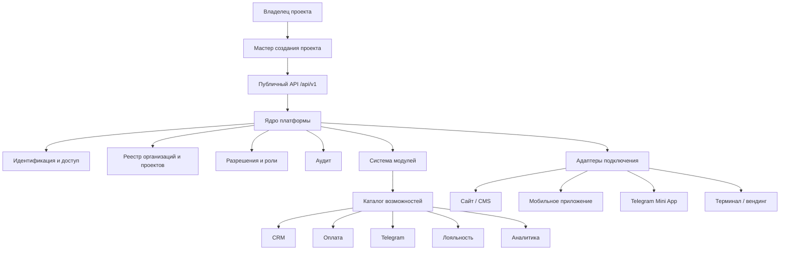

# Архитектура Lk_uni 2.0

## Статус

Принята как целевая продуктовая архитектура. Реализация выполняется поэтапно без параллельного переписывания существующего Auth Core.

## 1. Назначение платформы

Lk_uni — универсальная платформа для создания и эксплуатации цифровых рабочих пространств коммерческих проектов. Основной пользователь — владелец бизнеса без навыков программирования.

Платформа должна позволять создать проект, получить готовое рабочее пространство, подключить нужные возможности и при необходимости встроить их в существующий сайт, приложение, Telegram Mini App, терминал или вендинговый интерфейс.

## 2. Базовые принципы

1. Ядро не содержит отраслевой логики.
2. Пользователь начинает с действия «Создать мой проект».
3. Регистрация владельца входит в создание проекта.
4. Все проектные данные изолируются по проектному контексту.
5. Функциональность расширяется модулями.
6. Способ размещения не меняет бизнес-логику ядра.
7. Подключение к внешней среде выполняется через адаптеры.
8. Пользовательский интерфейс использует понятные бизнес-термины.
9. Публичные API и события версионируются.
10. Каждая итерация завершается работающим пользовательским сценарием.

## 3. Логическая схема



## 4. Ядро платформы

Ядро предоставляет только общие платформенные возможности:

- загрузка конфигурации;
- регистрация и жизненный цикл модулей;
- организации и проекты;
- пользователи и единая цифровая личность;
- роли и разрешения;
- проектный контекст;
- аудит;
- события;
- диагностика;
- публичные API-контракты.

Ядро не содержит CRM, торговли, лояльности, вендинга, медицинских процессов, складского учёта и других предметных функций.

## 5. Основная модель данных

Минимальный продуктовый контур:

- `organizations` — юридическая или организационная сущность;
- `projects` — рабочие пространства и проектный контекст;
- `users` — единая цифровая личность;
- `project_memberships` — участие пользователя в проекте;
- `roles` — роли;
- `permissions` — разрешения;
- `role_permissions` — состав роли;
- `settings` — настройки платформы, организации и проекта;
- `project_connections` — способы подключения и размещения;
- `module_catalog` — доступные возможности;
- `project_modules` — подключённые к проекту модули;
- `audit_log` — значимые действия.

Пользовательский термин «Рабочее пространство» соответствует внутренней сущности `project`.

## 6. Создание проекта

Первый сквозной сценарий:

1. Пользователь указывает название проекта.
2. Выбирает направление деятельности.
3. Создаёт учётную запись владельца.
4. Указывает предполагаемый способ использования.
5. Backend в одной транзакции создаёт организацию, проект, владельца, участие, роль и базовые настройки.
6. Пользователь автоматически авторизуется.
7. Открывается готовое рабочее пространство с рекомендуемыми следующими действиями.

Предварительные варианты размещения:

- облако Lk_uni;
- существующий сайт;
- отдельный домен или поддомен;
- собственный сервер;
- решение будет принято позже.

Выбранный вариант не должен блокировать создание проекта и может быть изменён позднее.

## 7. Система модулей

Модуль — изолированная возможность, подключаемая к конкретному проекту.

Каждый модуль обязан иметь `module.json`, публичный контракт, версию, зависимости, разрешения, миграции, события, тесты и процедуру отключения.

Категории первых модулей:

- клиенты;
- сотрудники;
- уведомления;
- Telegram;
- онлайн-оплата;
- программа лояльности;
- CRM;
- аналитика;
- API-доступ.

Проект хранит только перечень подключённых модулей и их настройки. Отключённый модуль не должен оставлять активные маршруты, обработчики или фоновые задачи.

## 8. Адаптеры подключения

Адаптер связывает Lk_uni с конкретной внешней средой, не перенося её особенности в ядро.

Планируемые адаптеры:

- HTML/JavaScript-виджет;
- WordPress;
- 1С-Битрикс;
- React;
- Vue;
- Telegram Mini App;
- мобильное приложение;
- терминал продавца;
- вендинговый аппарат.

Адаптер использует только публичный API, SDK и события. Прямой доступ адаптера к таблицам платформы запрещён.

## 9. Модели развёртывания

### Облачная

Многопроектный экземпляр Lk_uni обслуживает независимые организации и проекты. Изоляция обеспечивается проектным контекстом, разрешениями и ограничениями базы данных.

### На сервере клиента

Отдельный экземпляр разворачивается через воспроизводимый комплект установки. Минимальный целевой вариант — Docker Compose с PostgreSQL, backend, frontend, миграциями, healthcheck и резервным копированием.

### Встроенная

Личный кабинет размещается на поддомене, маршруте сайта или через виджет. Внешнее оформление может соответствовать бренду проекта, но аутентификация, сессии и права остаются под контролем Lk_uni.

## 10. API и интеграции

- REST API публикуется по `/api/v1`.
- Создание проекта выполняется отдельным атомарным endpoint.
- Все проектные endpoint требуют явного проектного контекста.
- Сервисные интеграции используют отдельные учётные данные и минимальные разрешения.
- Webhook и события имеют версию схемы и подпись.
- Секреты не передаются во frontend и не хранятся в открытом виде.

Первый новый контракт:

```text
POST /api/v1/projects
```

Он создаёт организацию, проект и владельца как единую операцию.

## 11. Контуры доступа

1. Пользовательское приложение — работа только со своим профилем и разрешёнными проектами.
2. Панель администратора проекта — управление одним разрешённым проектом.
3. Консоль владельца платформы — глобальные операции, изолированные от прав администратора проекта.

Администратор проекта не получает глобальные права автоматически.

## 12. Мастер развития проекта

После первого входа пользователь видит не пустую панель, а последовательность действий:

- заполнить сведения об организации;
- добавить логотип;
- выбрать способ размещения;
- пригласить сотрудника;
- подключить первый модуль;
- проверить вход и восстановление доступа;
- опубликовать проект.

Рекомендации формируются по состоянию проекта и выбранному сценарию, а не являются статичной инструкцией.

## 13. Правила разработки

1. Сначала утверждается пользовательский экран и действие.
2. Затем фиксируется API-контракт и модель данных.
3. Изменение выполняется в отдельной ветке.
4. Миграции должны иметь rollback.
5. Для проектной изоляции обязательны негативные тесты.
6. Новая функция должна быть доступна через публичный контракт, если она нужна адаптерам.
7. Документация обновляется одновременно с реализацией.
8. Стабильный код попадает в `main` только через Pull Request.

## 14. Поэтапная реализация

### Этап 1. Первый живой проект

- мастер создания;
- `POST /api/v1/projects`;
- транзакционное создание организации, проекта и владельца;
- автоматическая авторизация;
- первая главная страница рабочего пространства.

### Этап 2. Доступ и команда

- вход;
- полный процесс восстановления пароля;
- сотрудники;
- приглашения;
- роли и разрешения.

### Этап 3. Подключение проекта

- домен и поддомен;
- встроенный веб-режим;
- ключи интеграции;
- первый HTML/JavaScript-адаптер;
- комплект самостоятельного развёртывания.

### Этап 4. Каталог возможностей

- реестр модулей;
- подключение и отключение;
- настройки модулей;
- первые продуктовые модули.

### Этап 5. Экосистема

- адаптеры CMS и frontend-фреймворков;
- Telegram Mini App;
- терминальные интерфейсы;
- каталог сторонних расширений после появления стабильного контракта.

## 15. Ближайшее решение к реализации

Документ не заменяет разработку. Следующая рабочая итерация — подключение существующего мастера к настоящему `POST /api/v1/projects`, создание необходимых миграций и автоматический вход владельца в созданное рабочее пространство.
